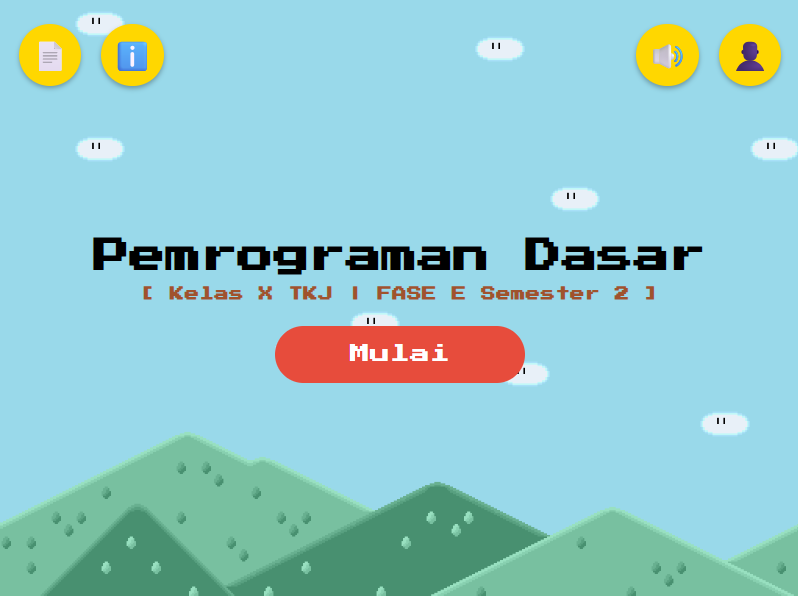

# 🎮 Game Mario Pembelajaran Pemrograman

Media pembelajaran berbasis game yang dikembangkan untuk membantu siswa mempelajari konsep **percabangan dan perulangan** dalam pemrograman dasar secara interaktif dan menyenangkan.

## 🎯 Tujuan

Project ini bertujuan untuk memberikan pengalaman belajar pemrograman yang lebih menarik melalui pendekatan **Game-Based Learning**

- 📚 **Materi Pembelajaran** - Materi mengenai percabangan dan perulangan.
- 📝 **Latihan Soal** - Latihan untuk menguji pemahaman siswa.
- 💻 **Coding Practice** - Tempat siswa mencoba dan menjalankan kode.
- 🏆 **Leaderboard** - Menampilkan skor dan pencapaian siswa.

## 🛠️ Teknologi

- HTML
- CSS
- JavaScript
- PHP
- MySQL

## 📸 Preview

## 👩‍💻 Developer

**Dian**

Project ini dikembangkan sebagai media pembelajaran pemrograman berbasis game dengan fokus pada materi percabangan dan perulangan.

## 🎓 Project Context

Project dikembangkan sebagai bagian dari pengembangan media pembelajaran untuk mendukung proses pembelajaran **Pemrograman Dasar** menggunakan pendekatan **Game-Based Learning**.

---

⭐ Terima kasih telah mengunjungi repository ini!
